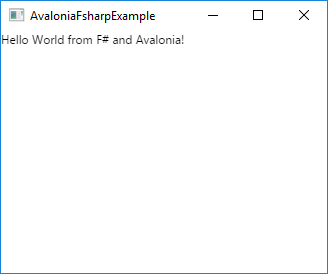
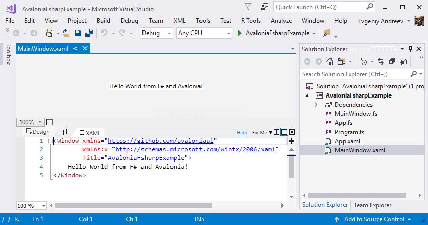

# Say hello to Avalonia

9 Dec 2017

_This article is part of [F# Advent calendar in English 2017](https://sergeytihon.com/2017/10/22/f-advent-calendar-in-english-2017/)._

## Introduction

[Avalonia](http://avaloniaui.net/) is a cross-platform UI .NET framework inspired by WPF and built around XAML and bindings. Why use another UI framework, you would ask? F# already has solid WPF-based infrastructure: [FsXAML](https://github.com/fsprojects/FsXaml), [FSharp.ViewModule](https://github.com/fsprojects/FSharp.ViewModule) and pretty awesome [Gjallarhorn.Bindable.WPF](https://github.com/ReedCopsey/Gjallarhorn.Bindable/tree/dc8e0ee75db5a428d901f1b826f0ec21b357ca25/src/Gjallarhorn.Bindable.Wpf). There is also [F# support](https://developer.xamarin.com/guides/cross-platform/fsharp/fsharp_support_overview/) in Xamarin which allows you write UI applications for mobile devices.

But what if you need to build a cross-platform desktop applicaton (not Windows-only as in case of WPF)? Maybe you also want to use the modern .NET Core platform? Run the same UI code on mobile devices? Avalonia for the rescue!

## Let's start

OK, let's start with an empty console .NET Core application. I usually use .NET Core CLI and wonderful [Ionide](http://ionide.io/) extension for code editing (_thanks a lot Krzysztof!_). Works like a charm.

```console
$ mkdir avalonia-fsharp-example
$ cd avalonia-fsharp-example
$ dotnet new console -lang f#
```

Then add Avalonia packages to the project.

```console
$ dotnet add package Avalonia
$ dotnet add package Avalonia.Desktop
```

All native dependencies for your platform will be installed automagically.

Then you need to create the core of our application and initialize Avalonia. Create two files:

```fsharp
// App.fs
namespace AvaloniaFsharpExample

open Avalonia
open Avalonia.Markup.Xaml

type App() =
    inherit Application()
    override this.Initialize() =
        AvaloniaXamlLoader.Load(this)
```

```xml
<!-- AvaloniaFsharpExample.App.xaml -->
<Application xmlns="https://github.com/avaloniaui">
  <Application.Styles>
    <StyleInclude Source="resm:Avalonia.Themes.Default.DefaultTheme.xaml?assembly=Avalonia.Themes.Default"/>
    <StyleInclude Source="resm:Avalonia.Themes.Default.Accents.BaseLight.xaml?assembly=Avalonia.Themes.Default"/>
  </Application.Styles>
</Application>
```

Hopefully you remember how to use OOP features in the F#! `App` type is the core of the application -- subtype of Avalonia's `Application` class. Avalonia uses XAML files for UI design: controls, windows, styles and bindings. In 2017, XAML may look a little clunky, but I still found it very convenient for UI design and especially if you already familiar with WPF or Xamarin. So you need to override `Initialize` method and load `App.xaml` file containing style settings for our application:

```fsharp
AvaloniaXamlLoader.Load(this)
```

It loads an appropriate `.xaml` for our type. I'll describe how it works in the next section. For now you need to create main window of the application.

In the main window, we are going to show a classical "hello world" text. Let's design it!

```xml
<!-- AvaloniaFsharpExample.MainWindow.xaml -->
<Window xmlns="https://github.com/avaloniaui"
        xmlns:x="http://schemas.microsoft.com/winfx/2006/xaml"
        Title="AvaloniaFsharpExample">
    Hello World from Avalonia and F#!
</Window>
```

You also need to load the XAML file into the application:

```fsharp
// MainWindow.fs
namespace AvaloniaFsharpExample

open Avalonia.Controls
open Avalonia.Markup.Xaml

type MainWindow () as this =
    inherit Window()

    do this.InitializeComponent()
    member this.InitializeComponent() =
        AvaloniaXamlLoader.Load(this)
```

The logic is the same as for `App.fs` -- we're loading a XAML file during the type initialization. Final step required to unite all the parts of the application is to write a proper entry point:

```fsharp
// Program.fs
open System
open Avalonia

open AvaloniaFsharpExample

[<EntryPoint>]
let main argv =
    AppBuilder.Configure<App>()
        .UsePlatformDetect()
        .Start<MainWindow>()
    0
```

Just as simple as "configure app using appropriate backend and then start with `MainWindow`". What does mean "backend"? At the lowest level, Avalonia uses different subsystems to work with windows and draw controls on them. Those parts are platform specific, but backend can be automagically detected. You can read more about Avalonia's architecture in the [documentation](http://avaloniaui.net/spec/architecture.html) (a little outdated).

## Say hello

So, can we finally run the application? Not yet. `AvaloniaXamlLoader` that we see before in the `App` and `MainWindow` types requires our XAML files to be placed in the binary resource section. To do that, we should to add `<EmbeddedResource>` items to our project:

```xml
  <ItemGroup>
    <EmbeddedResource Include="AvaloniaFsharpExample.MainWindow.xaml">
      <LogicalName>AvaloniaFsharpExample.MainWindow.xaml</LogicalName>
    </EmbeddedResource>

    <EmbeddedResource Include="AvaloniaFsharpExample.App.xaml">
      <LogicalName>AvaloniaFsharpExample.App.xaml</LogicalName>
    </EmbeddedResource>
  </ItemGroup>
```

In the resource section, these names should be formated as `[namespace].[type].xaml`, e.g. `AvaloniaFsharpExample.MainWindow.xaml`. It seems on Windows and MacOS resource embedding behaviours are different, so you need use both explicit file name and `LogicalName` in project (_I'm going to create issue about it_).

And don't forget to add source code files into project. Remember about the files order!

```xml
<ItemGroup>
    <Compile Include="MainWindow.fs" />
    <Compile Include="App.fs" />
    <Compile Include="Program.fs" />
</ItemGroup>
```

Finally we can run it!

```console
$ dotnet run
```

You will see the following window:



Please note if you're MacOS user you need to install `gtk+3` via `brew`. It seems this issue is [fixed](https://github.com/AvaloniaUI/Avalonia/issues/1294) in the nightly build of Avalonia.

## Visual designer

If you're a Visual Studio user, you will probably like [Avalonia for Visual Studio](https://marketplace.visualstudio.com/items?itemName=AvaloniaTeam.AvaloniaforVisualStudio) extension. It contains visual designer for Avalonia XAML similar to WPF XAML designer.

Unfortunately, according to [this issue](https://github.com/AvaloniaUI/Avalonia/issues/1134), XAML designer doesn't yet work on pure .NET Core applications. Therefore, to make it work, you need to add .NET Framework target to our `fsproj`.

```xml
<TargetFrameworks>netcoreapp2.0;net461</TargetFrameworks>
```

Make sure that you use `TargetFramework_s_`. Then open project with Visual Studio and you will see following:



That's also possible because of [hard work](https://www.visualstudio.com/en-us/news/releasenotes/vs2017-relnotes#fsharpnetcoreimprovements) of Visual F# contributors and MSFT team. Thanks you guys!

## Conclusion

Hope you enjoyed this introductory blog post. In the next articles, we'll see how to write a simple UI and bind it to the underlying data model. We will try to use different programming styles: from OOP and FP perspectives (and get hyped with Gjallarhorn). Stay tuned!

You can find code in [repository](https://github.com/gsomix/avalonia-fsharp-example).

I also want to say thanks to [Avalonia team](https://github.com/orgs/AvaloniaUI/people) for great job. You rock!